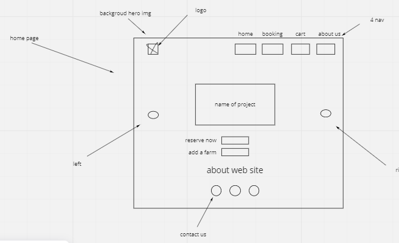
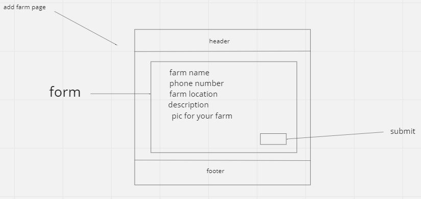
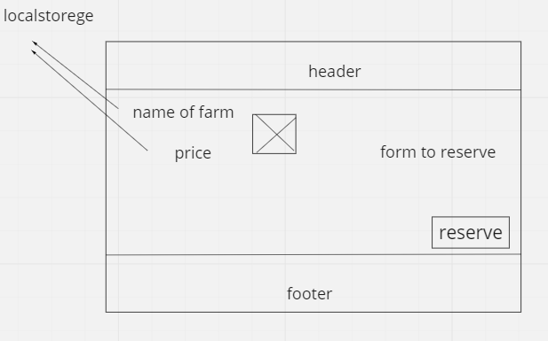
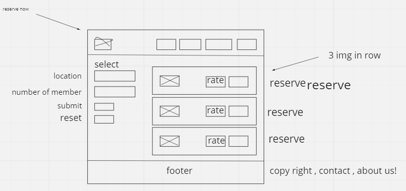
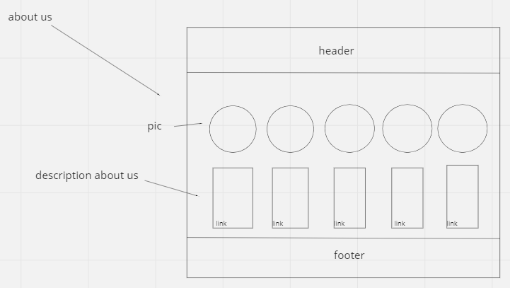

# User Stories :
1. as a user I want to rent a cottage, I will press reserve now, or book now filter according to features I want.then pick the cottage by clicking reserve button, it will open a page with a form that requiers reservation details, I fill them, then press confirm. 
2.  as a user I want to add a cottage to this website , I will press on add cottage button from home page it will open a page with form that needs to be filled with cottage details, then add new cottage button. 
3. as a user I want to see the cottages I will press on book now navigator and see all available cottages.
4. as a user I want to rate a cottage from one to 5, I will press on book now navigator go to the cottage I want to rate and fill stars by the rate i want to give.
5. as a user I want to see who made this website , I will press on about us navigator, it will open a page with website creaters information.

# WIREFRAMES :

### Home Page

### Add Cottage

### Booking

### Browse Cottage

### About Us

